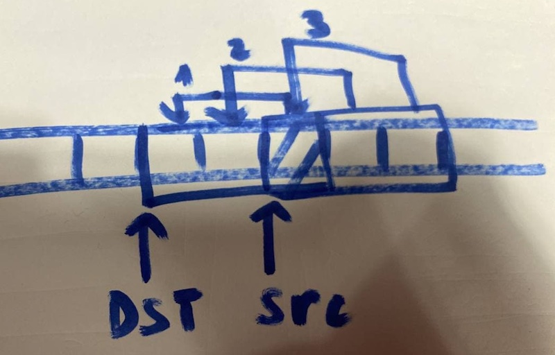

На гите в поиске пишешь libft и берешь любые тесты,    
лично здесь ~~Libftest~~ и libft-unit-test и libft-war-machine

-------- 


#### size_t
```
Для представления величин, связанных с памятью, в C есть typedef'ы size_t и ptrdiff_t.  Размер определяется архитектурой процессора.  
	#include <string.h> или #include <stddef.h>  
size_t — беззнаковый тип для представления размера любого объекта (включая массив).  
Он способен хранить в себе размер максимального массива,  
который может быть теоретически выделен в рамках данной архитектуры.  
Оператор sizeof возвращает результат типа size_t.  
Для size_t гарантируется, что он как минимум 16-битный.  
```
-------- 
### atoi
int	atoi(const char *str);  
ОПИСАНИЕ: Функция atoi () преобразует начальную часть строки, на которую указывает str, в представление типа int.  
Это эквивалентно:  
           (int) strtol (str, (char **) NULL, 10);  
ЗАМЕЧАНИЯ ПО РЕАЛИЗАЦИИ: Функции atoi () и atoi_l () являются поточно-ориентированными и асинхронно-отменяющими.  
ОШИБКИ: Функция atoi () не должна влиять на значение errno при ошибке.  
ВОЗВРАЩАЕМОЕ ЗНАЧЕНИЕ:  
```
 #include <stdlib.h>
```
--------  
### bzero 
void	bzero(void *s, size_t n);  
ОПИСАНИЕ: Функция bzero() устанавливает первые n байтов области, начинающейся с s в нули (пустые байты).  
```
	#include <strings.h>
```
-------- 
### calloc
void	*calloc(size_t count, size_t size);  
ОПИСАНИЕ: Функции malloc(), calloc(), valloc(), realloc() и reallocf() выделяют память.  Выделенная память выровнена так, что ее можно использовать для любого типа данных, включая типы, связанные с AltiVec и SSE.  
Функция calloc() непрерывно выделяет достаточно места для объектов count, каждый из которых имеет size в байтах памяти, и возвращает указатель на выделенную память.  Выделенная память заполняется байтами с нулевым значением.  
ВОЗВРАЩАЕМОЕ ЗНАЧЕНИЕ: В случае успеха функции calloc(), malloc(), realloc(), reallocf(), valloc() и align_alloc() возвращают указатель на выделенную память. Если возникает ошибка, они возвращают указатель NULL и устанавливают для errno значение ENOMEM.
```
#include <stdlib.h>
```
--------  
### isalnum
int	isalnum(int c)  
ОПИСАНИЕ: Функция isalnum () проверяет любой символ, для которого истинно isalpha (3) или isdigit (3).  
Значение аргумента должно быть представлено в виде символа без знака или значения EOF.  
ВОЗВРАЩАЕМОЕ ЗНАЧЕНИЕ: Функция возвращает ноль, если проверка символа неудачна, и возвращает ненулевое значение, если символ проверку прошел.  
```
#include <ctype.h>
```
--------  
### isalpha
int	isalpha(int c);  
ОПИСАНИЕ: Функция isalpha() проверяет любой символ, для которого истинно isupper(3) или islower(3).  
Значение аргумента должно быть представлено в виде символа без знака или значения EOF.  
ВОЗВРАЩАЕМОЕ ЗНАЧЕНИЕ: Функция isalpha() возвращает ноль, если проверка символа неудачна, и возвращает ненулевое значение, если символ проверку прошел.  
```
 #include <ctype.h>
```
--------  
### isascii
int	isascii(int c);  
ОПИСАНИЕ:  Функция isascii () проверяет наличие символа ASCII, который представляет собой любой символ от 0 до восьмеричного 0177 (127 десятиричный) включительно.  
ВОЗВРАЩАЕМОЕ ЗНАЧЕНИЕ: Функция возвращает ноль, если проверка символа неудачна, и возвращает ненулевое значение, если символ проверку прошел.  
```
#include <ctype.h>
```
--------  
### isdigit
int	isdigit(int c);  
ОПИСАНИЕ: Функция isdigit () проверяет наличие символа десятичной цифры.  
Значение аргумента должно быть представлено в виде символа без знака или значения EOF.  
ВОЗВРАЩАЕМОЕ ЗНАЧЕНИЕ: Функция возвращает ноль, если проверка символа неудачна, и возвращает ненулевое значение, если символ проверку прошел.
```
#include <ctype.h>
```
--------  
### isprint
int	isprint(int c);  
ОПИСАНИЕ:  Функция isprint () проверяет наличие любого печатного символа, включая пробел (' ').  
Значение аргумента должно быть представлено в виде символа без знака или значения EOF.  
В наборе символов ASCII это включает следующие символы (которым предшествуют их числовые значения в восьмеричном формате):  (очень много)  
ВОЗВРАЩАЕМОЕ ЗНАЧЕНИЕ: Функция возвращает ноль, если проверка символа неудачна, и возвращает ненулевое значение, если символ проверку прошел.  
```
#include <ctype.h>
```
--------  
### ft_itoa
char	*ft_itoa(int n);  
ОПИСАНИЕ: Выделяет (с помощью malloc (3)) и возвращает строку, представляющую целое число, полученное в качестве аргумента. Отрицательные числа нужно обрабатывать.  
n - целое число для преобразования.  
ВОЗВРАЩАЕМОЕ ЗНАЧЕНИЕ: Строка, представляющая целое число. NULL, если размещение не удается.  
```
NO LIBRARY
```
--------  
### memccpy
void	*memccpy(void *restrict dst, const void *restrict src, int c, size_t n);   
ОПИСАНИЕ: Функция memccpy () копирует байты из строки src в строку dst. Если символ c (преобразованный в беззнаковый char) встречается в строке src, копирование останавливается и возвращается указатель на байт после копии c в строке dst. В противном случае копируется n байтов и возвращается NULL-указатель.  
Строки источника и назначения не должны перекрываться, поскольку поведение не определено.  
```
#include <string.h>
```
--------  
### memchr
void	*memchr(const void *s, int c, size_t n);  
ОПИСАНИЕ: Функция memchr () находит первое вхождение c (преобразованное в unsigned char) в строке s.   
ВОЗВРАЩАЕМОЕ ЗНАЧЕНИЕ: Функция memchr () возвращает указатель на найденный байт или NULL, если такого байта не существует в пределах n байтов.  
```
#include <string.h>
```
--------  
### memcmp  
int	memcmp(const void *s1, const void *s2, size_t n);  
ОПИСАНИЕ: Функция memcmp () сравнивает байтовую строку s1 с байтовой строкой s2.  Предполагается, что обе строки имеют длину n байтов.  
ВОЗВРАЩАЕМОЕ ЗНАЧЕНИЕ: Функция memcmp () возвращает ноль, если две строки идентичны, в противном случае возвращает разницу между первыми двумя разными байтами. (обрабатывается как беззнаковые значения char, так что '\200' больше, чем '\0', например). Строки нулевой длины всегда идентичны. Такое поведение не требуется для C, и переносимый код должен зависеть только от знака возвращаемого значения.  
```
#include <string.h>
```
--------  
### memcpy
void	*memcpy(void *restrict dst, const void *restrict src, size_t n);  
ОПИСАНИЕ: Функция memcpy () копирует n байтов из области памяти src в область памяти dst. Если dst и src перекрываются, поведение не определено. В случаях, в которых dst и src могут перекрываться, вместо этого следует использовать memmove (3).  
ВОЗВРАЩАЕМОЕ ЗНАЧЕНИЕ: Функция memcpy () возвращает исходное значение dst.  
```
#include <string.h>
Ключевое слово restrict позволяет программисту сообщить компилятору, что объявляемый указатель адресует область памяти, на которую не ссылается никакой другой указатель.  Гарантию того, что на участок памяти не будут ссылаться более одного указателя, даёт программист.
```
--------  
### memmove
void	*memmove(void *dst, const void *src, size_t len);  
ОПИСАНИЕ: Функция memmove () копирует len байтов из строки src в строку dst. Две строки могут перекрываться; копирование всегда выполняется в неразрушающем манера.  
ВОЗВРАЩАЕМОЕ ЗНАЧЕНИЕ: Функция memmove () возвращает исходное значение dst.  
```
#include <string.h>
```

```
Если цель левее источника, то надо слева направо копировать, 
чтоб не перезаписать (не потерять) источник. 
Если цель правее источника, то надо справа налево копировать, 
чтобы не перезаписать (не потерять) источник. 
```
--------  
### memset
void *memset (void *s, int v, size_t n);  
ОПИСАНИЕ: Копирует значение v (преобразованное в тип unsigned char) в первые n байтов,которые находятся по адресу, указанному s; возвращает s  
```
#include <string.h>  
Следующий фрагмент программы присваивает начальные значения 0 первым ста байтам массива,  
на который указывает buf, затем записывает в первые 10 байт символ 'X'  
и выводит на экран строку «ХХХХХХХХХХ»:  
	char	buf[10000];  
	memset(buf, '\0', 100);  
	memset(buf, 'X', 10);  
	printf ("%s\n", (char *) buf);
```
--------  
### ft_putchar_fd
void	ft_putchar_fd(char c, int fd);  
ОПИСАНИЕ: Выводит символ ’c’ в указанный файловый дескриптор.  
c - Символ для вывода.  
fd - Дескриптор файла для записи.  
ВОЗВРАЩАЕМОЕ ЗНАЧЕНИЕ: None  
```
NO LIBRARY
```
--------  
### ft_putendl_fd
void	ft_putendl_fd(char *s, int fd);  
ОПИСАНИЕ: Выводит строку 's' в указанный файловый дескриптор, за которой следует новая строка.   
Outputs the string ’s’ to the given file descriptor, followed by a newline.  
s - Строка для вывода.  
fd - Дескриптор файла для записи.  
ВОЗВРАЩАЕМОЕ ЗНАЧЕНИЕ: None  
```
NO LIBRARY
```
--------  
### ft_putnbr_fd
void ft_putnbr_fd(int n, int fd);  
ОПИСАНИЕ: Выводит целое число 'n' в указанный файловый дескриптор.  
n - Целое число для вывода.  
fd - Дескриптор файла для записи.  
ВОЗВРАЩАЕМОЕ ЗНАЧЕНИЕ: None
```
NO LIBRARY
```
--------  
### ft_putstr_fd
void	ft_putstr_fd(char *s, int fd);  
ОПИСАНИЕ: Выводит строку в указанный файловый дескриптор.  
s - Строка для вывода.  
fd - Дескриптор файла для записи.  
ВОЗВРАЩАЕМОЕ ЗНАЧЕНИЕ: None  
```
NO LIBRARY
```
-------- 
### ft_split
char	**ft_split(char const *s, char c);  
ОПИСАНИЕ: Выделяет (с помощью malloc (3)) и возвращает массив строк, полученных разделением с помощью символ ’c’ в качестве разделителя. Массив должен заканчиваться указателем NULL.  
s - Строка, которую нужно разделить.  
c - Символ-разделитель.  
ВОЗВРАЩАЕМОЕ ЗНАЧЕНИЕ: Массив новых строк, полученных в результате разделения. NULL, если выделение не удалось.  
```
NO LIBRARY
```
--------  
### strchr
char	*strchr(const char *s, int c);  
ОПИСАНИЕ: Функция strchr () находит первое вхождение c (преобразованного в char) в строке, на которую указывает s. Завершающий нулевой символ считается частью строки; поэтому, если c равно '\0', функции находят завершающий '\0'.  
ВОЗВРАЩАЕМОЕ ЗНАЧЕНИЕ: Функции strchr () и strrchr () возвращают указатель на найденный символ или NULL, если символ не появляется в строке.  
```
#include <string.h>
```
--------  
### strdup
char	*strdup(const char *s1);  
ОПИСАНИЕ: Функция strdup () выделяет достаточно памяти для копии строки s1, выполняет копию и возвращает указатель на нее.  
Указатель впоследствии можно использовать в качестве аргумента функции free (3).  
Если доступной памяти недостаточно, возвращается NULL, а для errno устанавливается значение ENOMEM.  
ВОЗВРАЩАЕМОЕ ЗНАЧЕНИЕ:  
```
#include <string.h>
```
--------  
### ft_strjoin
char *ft_strjoin(char const *s1, char const *s2);  
ОПИСАНИЕ: Выделяет (с помощью malloc (3)) и возвращает новую строку, которая является результатом конкатенации из ’s1’ и ’s2’.  
s1 - Строка префикса.  
s2 - Строка суффикса.
ВОЗВРАЩАЕМОЕ ЗНАЧЕНИЕ: Новая строка. NULL, если выделение не удалось.  
```
NO LIBRARY
```
--------  
### strlcat
size_t	strlcat(char * restrict dst, const char * restrict src, size_t dstsize);  
ОПИСАНИЕ: Функции strlcpy () и strlcat () копируют и объединяют строки с теми же входными параметрами и выходным результатом, что и snprintf (3). Они предназначены для более безопасной, более последовательной и менее подверженной ошибкам замены легко используемых функций strncpy (3) и strncat (3).  
strlcpy () и strlcat () принимают полный размер целевого буфера и гарантируют NUL-завершение, если есть место. Обратите внимание, что место для NUL должно быть включено в dstsize.  
strlcat () добавляет строку src в конец dst. Он будет добавлять не более (dstsize - strlen (dst) - 1) символов. Затем он завершится NUL, если dstsize не равен 0 или исходная строка dst была длиннее, чем dstsize (на практике этого не должно происходить, поскольку это означает, что либо dstsize неверен, либо dst не является правильной строкой).  
Если строки src и dst перекрываются, поведение не определено.  
ВОЗВРАЩАЕМОЕ ЗНАЧЕНИЕ: Помимо придирок по поводу типа возвращаемого значения (size_t вместо int) и безопасности обработчика сигналов (snprintf (3) не совсем безопасен в некоторых системах), следующие два эквивалентны:  
           n = strlcpy (dst, src, len);  
           n = snprintf (dst, len, "% s", src);  
Как и snprintf (3), функции strlcpy () и strlcat () возвращают общую длину строки, которую они пытались создать. Для strlcat () это означает начальную длину dst плюс длину src.  
Если возвращаемое значение >= dstsize, выходная строка была усечена. Ответственность за это несет вызывающий абонент.  
```
#include <string.h>
```
--------  
### strlcpy
size_t	strlcpy(char * restrict dst, const char * restrict src, size_t dstsize);  
ОПИСАНИЕ: Функции strlcpy () и strlcat () копируют и объединяют строки с теми же входными параметрами и выходным результатом, что и snprintf (3). Они разработаны для более безопасной, более последовательной и менее подверженной ошибкам замены легко используемых функций strncpy (3) и strncat (3).  
strlcpy () и strlcat () принимают полный размер целевого буфера и гарантируют NUL-завершение, если есть место. Обратите внимание, что место для NUL должно быть включено в dstsize.  
strlcpy () копирует до (dstsize - 1) символов из строки src в dst, завершая результат NUL, если dstsize не 0.  
Если строки src и dst перекрываются, поведение не определено.  
ВОЗВРАЩАЕМОЕ ЗНАЧЕНИЕ: Помимо придирок по поводу типа возвращаемого значения (size_t вместо int) и безопасности обработчика сигналов (snprintf (3) не совсем безопасен в некоторых системах), следующие два эквивалентны:  
           n = strlcpy (dst, src, len);  
           n = snprintf (dst, len, "% s", src);  
Как и snprintf (3), функции strlcpy () и strlcat () возвращают общую длину строки, которую они пытались создать. Для strlcpy () это означает длину src.  
Если возвращаемое значение >= dstsize, выходная строка была усечена. Ответственность за это несет вызывающий абонент.  
```
#include <string.h>
```
-------- 
### strlen
size_t	strlen(const char *s);  
ОПИСАНИЕ: Функция strlen () вычисляет длину строки s.  
ВОЗВРАЩАЕМОЕ ЗНАЧЕНИЕ: Функция strlen () возвращает количество символов, предшествующих завершающему символу NUL.  
```
#include <string.h>
```
--------  
### ft_strmapi
char	*ft_strmapi(char const *s, char (*f)(unsigned int, char));  
ОПИСАНИЕ: Применяет функцию ’f’ к каждому символу строки ’s’ для создания новой строки (с помощью malloc (3)) в результате последовательного применения 'f'.  
s - Строка, по которой выполняется итерация.  
f() - Функция, применяемая к каждому символу.  
ВОЗВРАЩАЕМОЕ ЗНАЧЕНИЕ: Строка, созданная последовательным применением 'f'. Возвращает NULL, если выделение не удалось.  
```
NO LIBRARY
```
--------  
### strncmp
int	strncmp(const char *s1, const char *s2, size_t n);  
ОПИСАНИЕ: Функции strcmp () и strncmp () лексикографически сравнивают строки s1 и s2 с завершающим нулем.  
Функция strncmp () сравнивает не более n символов. Поскольку strncmp () предназначена для сравнения строк, а не двоичных данных, символы, которые появляются после символа '\0', не сравниваются.  
ВОЗВРАЩАЕМОЕ ЗНАЧЕНИЕ:  Функции strcmp () и strncmp () возвращают целое число больше, равное или меньше 0, в зависимости от того, что строка s1 больше, равна или меньше строки s2. Сравнение выполняется с использованием беззнаковых символов, так что '\200' больше, чем '\0'.  
```
#include <string.h>
```
--------  
### strnstr
char *strnstr(const char *haystack, const char *needle, size_t len);  
ОПИСАНИЕ: Функция strnstr () находит первое вхождение нуль-терминированного needle в ​​haystack, не далее len символов от начала haystack. Символы, которые появляются после символа `\0 ', не ищутся. Поскольку функция strnstr () является специфическим для FreeBSD API, её следует использовать только тогда, когда переносимость не вызывает беспокойства.  
ВОЗВРАЩАЕМОЕ ЗНАЧЕНИЕ: Если needle - пустая строка, возвращается haystack; если needle не находится в haystack возвращается NULL; в противном случае указатель на первый      возвращается символ первого появления needle.  
```
#include <string.h>
```
--------  
### strrchr
char *strrchr(const char *s, int c);  
ОПИСАНИЕ: Функция strrchr () находит последнее вхождение c (преобразованного в char) в строке, на которую указывает s. Завершающий нулевой символ считается частью строки; поэтому, если c равно '\0', функции находят завершающий '\0'.  
ВОЗВРАЩАЕМОЕ ЗНАЧЕНИЕ: Функции strchr () и strrchr () возвращают указатель на найденный символ или NULL, если символ не появляется в строке.  
```
#include <strings.h>
```
--------  
### ft_strtrim
char	*ft_strtrim(char const *s1, char const *set);  
ОПИСАНИЕ: Выделяет (с помощью malloc (3)) и возвращает копию ’S1’ с удаленными от начала и до конца строки символами, указанными в ’set’.  
Allocates (with malloc(3)) and returns a copy of ’s1’ with the characters specified in ’set’ removed from the beginning and the end of the string.  
s1 - Обрезаемая строка.  
set - Контрольный набор символов для обрезки.  
ВОЗВРАЩАЕМОЕ ЗНАЧЕНИЕ: Обрезанная строка. NULL, если выделение не удалось.  
```
NO LIBRARY
```
--------  
### ft_substr
char *ft_substr(char const *s, unsigned int start, size_t len);  
ОПИСАНИЕ: Выделяет (с помощью malloc(3)) и возвращает подстроку из строки ’s’.  
Подстрока начинается с индекса 'start' и имеет максимальный размер ’len’.  
's' - Строка, из которой создается подстрока.  
'start' - Начальный индекс подстроки в строке 'S'.  
'len' - Максимальная длина подстроки.  
ВОЗВРАЩАЕМОЕ ЗНАЧЕНИЕ: Подстрока. NULL, если выделение не удалось.  
```
NO LIBRARY
```
--------  
### tolower
int	tolower(int c);  
ОПИСАНИЕ: Функция tolower() преобразует заглавную букву в соответствующую строчную букву.  Аргумент должен быть представлен в виде символа без знака или значения EOF.  
функция tolower() использует текущий языковой стандарт.  
ВОЗВРАЩАЕМОЕ ЗНАЧЕНИЕ: Если аргумент - это заглавная буква, функция tolower() возвращает соответствующую строчную букву, если таковая имеется; в противном случае аргумент возвращается без изменений.  

```
#include <ctype.h>
```
--------  
### toupper
int	toupper(int c);  
ОПИСАНИЕ: Функция toupper() преобразует строчную букву в соответствующую прописную букву. Аргумент должен быть представлен в виде символа без знака или значения EOF.  
функция toupper() использует текущий языковой стандарт.  
ВОЗВРАЩАЕМОЕ ЗНАЧЕНИЕ: Если аргумент - это строчная буква, функция toupper() возвращает соответствующую прописную букву, если таковая имеется; в противном случае аргумент возвращается без изменений.  
```
#include <ctype.h>
```
--------  
 

### ft_lstnew
t_list *ft_lstnew(void *content);  
ОПИСАНИЕ: Allocates (with malloc(3)) and returns a new element.  The variable ’content’ is initialized with the value of the parameter ’content’.  The variable ’next’ is initialized to NULL.  
ВОЗВРАЩАЕМОЕ ЗНАЧЕНИЕ: The new element.  
```
NO PROTOTYPE
```
--------  
### ft_lstadd_front
void ft_lstadd_front(t_list **lst, t_list *new);  
ОПИСАНИЕ: Adds the element ’new’ at the beginning of the list.  
lst -  The address of a pointer to the first link of a list.  
new -  The address of a pointer to the element to be added to the list.  
ВОЗВРАЩАЕМОЕ ЗНАЧЕНИЕ: 
```
NO PROTOTYPE
```
--------  
### ft_lstsize
int ft_lstsize(t_list *lst);  
ОПИСАНИЕ: Counts the number of elements in a list.  
lst - The beginning of the list.  
ВОЗВРАЩАЕМОЕ ЗНАЧЕНИЕ: Length of the list.  
```
NO PROTOTYPE
```
--------  
### ft_lstlast
t_list *ft_lstlast(t_list *lst);  
ОПИСАНИЕ: Returns the last element of the list.  
lst - The beginning of the list.
ВОЗВРАЩАЕМОЕ ЗНАЧЕНИЕ: Last element of the list.  
```
NO PROTOTYPE
```
--------  
### ft_lstadd_back
void ft_lstadd_back(t_list **lst, t_list *new);  
ОПИСАНИЕ: Adds the element ’new’ at the end of the list.  
lst -  The address of a pointer to the first link of a list.  
new -  The address of a pointer to the element to be added to the list.  
ВОЗВРАЩАЕМОЕ ЗНАЧЕНИЕ: None  
```
NO PROTOTYPE
```
--------  
### ft_lstdelone
void	ft_lstdelone(t_list *lst, void (*del)(void *));  
External functs. free  
ОПИСАНИЕ: Takes as a parameter an element and frees the memory of the element’s content using the function ’del’ given as a parameter and free the element.  
The memory of ’next’ must not be freed.  
#1.  The element to free.  
#2.  The address of the function used to delete the content.  
ВОЗВРАЩАЕМОЕ ЗНАЧЕНИЕ: None  
```
NO PROTOTYPE
```
--------  
### ft_lstclear
void	ft_lstclear(t_list **lst, void (*del)(void *));  
External functs. free  
ОПИСАНИЕ: Deletes and frees the given element and every successor of that element,  
using the function ’del’ and free(3).  
Finally, the pointer to the list must be set to NULL.  
#1.  The adress of a pointer to an element.  
#2.  The adress of the function used to delete the content of the element.  
ВОЗВРАЩАЕМОЕ ЗНАЧЕНИЕ: None  
```
NO PROTOTYPE
```
--------  
### ft_lstiter
void ft_lstiter(t_list *lst, void (*f)(void *));  
ОПИСАНИЕ: Iterates the list ’lst’ and applies the function ’f’ to the content of each element.  
lst -  The adress of a pointer to an element.  
f -  The adress of the function used to iterate on the list.  
ВОЗВРАЩАЕМОЕ ЗНАЧЕНИЕ: None  
```
NO PROTOTYPE
```
--------  
### ft_lstmap
t_list *ft_lstmap(t_list *lst, void *(*f)(void *), void (*del)(void *));  
External functs: malloc, free  
ОПИСАНИЕ: Iterates the list ’lst’ and applies the function ’f’ to the content of each  element.  Creates a new list resulting of the successive applications of the function ’f’.   The ’del’ function is used to delete the content of an element if needed.  
#1.  The adress of a pointer to an element.  
#2.  The adress of the function used to iterate on the list.  
#3.  The adress of the function used to delete the content of an element if needed.  
ВОЗВРАЩАЕМОЕ ЗНАЧЕНИЕ: The new list.  NULL if the allocation fails.  
```
NO PROTOTYPE
```
--------  
### 

ОПИСАНИЕ: 
ВОЗВРАЩАЕМОЕ ЗНАЧЕНИЕ: 
```

```
--------  
### 

ОПИСАНИЕ: 
ВОЗВРАЩАЕМОЕ ЗНАЧЕНИЕ: 
```

```
--------  
### 

ОПИСАНИЕ: 
ВОЗВРАЩАЕМОЕ ЗНАЧЕНИЕ: 
```

```
